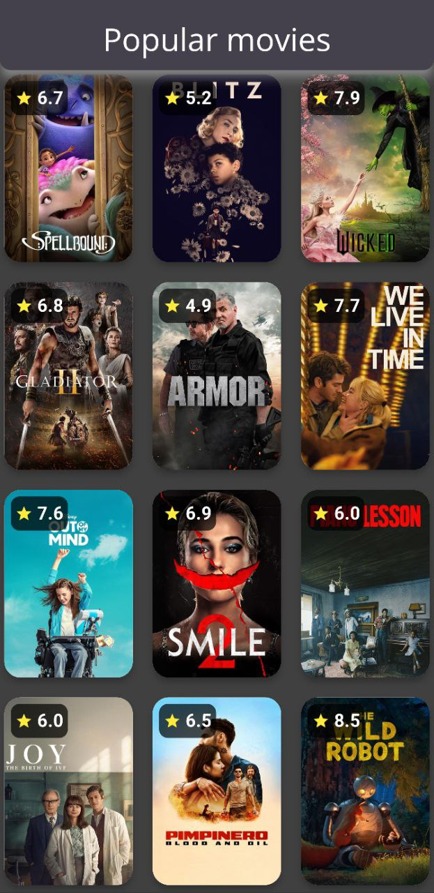

# Movie Browse

## Description

A Flutter application for browsing a list of films, that are popular right now.

## Main Libraries

* **http** - sending requests to API
* **get_it** - dependecy injection
* **provider** - viewmodel

### Prerequisites

Get your api key from the [official website of an API](https://developer.themoviedb.org/docs/getting-started) and pass it into path inside **.env** inside root directory and name it API_KEY.
